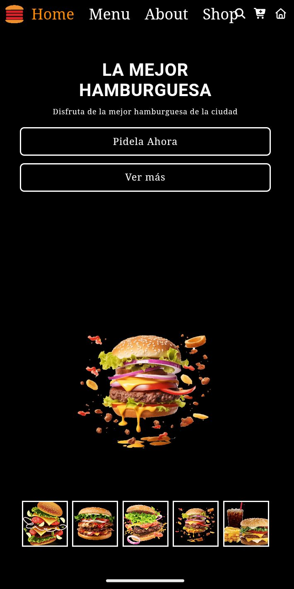

# 🍔 HamburgueZas - Landing Page

Landing page desarrollada para un negocio de hamburguesas, diseñada para presentar productos, generar confianza y facilitar el contacto con clientes.

Este proyecto forma parte de mi portfolio como desarrollador web enfocado en la creación de páginas para negocios locales.

---

## 🚀 Demo

---

## 🖼 Vista del proyecto

---

## 🛠 Tecnologías utilizadas

- HTML5  
- CSS3  
- JavaScript  

---

## 📂 Características

✔ Diseño atractivo para gastronomía  
✔ Sección de productos (hamburguesas)  
✔ Diseño responsive para móviles  
✔ Interfaz clara y moderna  
✔ Enfoque en conversión de clientes  

---

## 🎯 Objetivo del proyecto

Este proyecto fue desarrollado para:

- Crear una landing page para un negocio gastronómico  
- Practicar diseño enfocado en ventas  
- Desarrollar un sitio atractivo para clientes reales  

---

## 👨‍💻 Autor

Carlos Daniel Martínez  

🔗 GitHub  
https://github.com/carlosdm121
